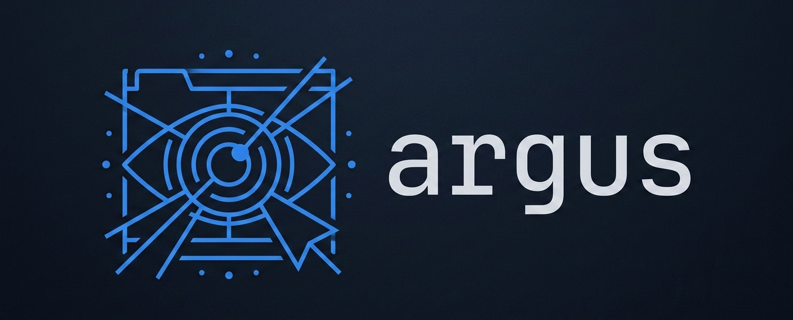

<p align="center">
  
</p>

<p align="center">
  Chrome DevTools Protocol MCP server — give AI agents eyes into a live browser.
</p>

<p align="center">
  
  
  
</p>

---

Argus connects directly to Chrome via the [Chrome DevTools Protocol](https://chromedevtools.github.io/devtools-protocol/) and exposes browser debugging as MCP tools - no Puppeteer, no Playwright, no browser abstraction layer. Spawn Chrome, attach to tabs, record console output, intercept network requests, inject mocks, and capture screenshots, all from your MCP client.

The name comes from Argus Panoptes - the 100-eyed giant of Greek mythology who could watch everything at once and never fully slept. That's the goal: total visibility into what the browser is doing.

## Motivation

Argus came about as part of an ongoing exploration into leveraging agents to reproduce reported issues as well as "manually" debug/record them on the fly. As a result you can expect to see bugs in Argus itself as well as plenty room for improvement and growth over time.

## Features

- **Console recording** — capture `console.log/warn/error` and unhandled exceptions with stack traces
- **Screenshot capture** — viewport, full-page, or clipped region, returned as base64 PNG/JPEG
- **Network recording** — record every request and response including body, headers, timing, and errors
- **Network mocking** — intercept requests by glob pattern and return custom responses, zero page reload required
- **Multi-tab** — attach to any number of tabs simultaneously, each with independent recording state
- **No dependencies** — direct WebSocket connection to Chrome's debug port, no browser driver needed
- **Injectable overlay** — floating status widget injected into every inspected page showing live counts

## Installation

### From npm (recommended)

```bash
# Install globally
npm install -g @jmsa/argus-mcp
argus-mcp

# Or run without installing
npx @jmsa/argus-mcp
```

### From source

```bash
git clone https://github.com/Jmsa/argus
cd argus
npm install
npm run dev
```

Chrome Canary opens automatically on startup with the Argus welcome page. Connect your MCP client to the stdio transport and start using the tools.

### Requirements

- Node ≥ 18
- Google Chrome or Chrome Canary (macOS, Linux, or Windows)

### MCP Client Configuration

**Claude Code** — run this once:

```bash
# npm package (recommended)
claude mcp add --transport stdio argus -- argus-mcp

# from source
claude mcp add --transport stdio argus -- npm run dev
```

**Claude Desktop** — add to `claude_desktop_config.json`:

```json
{
  "mcpServers": {
    "argus": {
      "type": "stdio",
      "command": "argus-mcp"
    }
  }
}
```

> If running from source instead, use `"command": "npm"` with `"args": ["run", "dev"]` and set `"cwd"` to the project root.

## Auto-Launch Behavior

By default, Argus does **not** automatically launch Chrome when a Claude session starts. Use the `browser_launch` tool to start Chrome when you need it.

### First-run experience

The first time Claude starts with Argus installed, Chrome opens once automatically so you can verify everything is working. A message on the welcome page explains what's happening. After that first session, auto-launch is off unless you enable it.

### The auto-launch toggle

The welcome page always shows a **Yes / No** toggle for auto-launch:

- **No** (default) — Chrome does not open on Claude start; call `browser_launch` manually
- **Yes** — Chrome and the welcome page open automatically at the start of every Claude session

The toggle takes effect immediately and persists across sessions. Your preference is stored in `~/.argus/config.json` and can also be edited manually:

```json
{ "autoLaunch": true }
```

### CI / scripted environments

Set `ARGUS_NO_LAUNCH=1` to force-skip Chrome launch regardless of the config file. This is useful in CI pipelines or automated environments where a display isn't available.

## Tools

Argus exposes 32 tools across eight groups.

### Browser

| Tool | Description |
|---|---|
| `browser_launch` | Spawn a new Chrome instance with remote debugging |
| `browser_connect` | Attach to an already-running Chrome via WebSocket URL |
| `browser_disconnect` | Disconnect (browser stays open) |
| `browser_status` | Check connection state and active tab count |

### Tabs

| Tool | Description |
|---|---|
| `tab_list` | List all open page tabs |
| `tab_open` | Open a new tab and navigate to a URL |
| `tab_navigate` | Navigate an existing tab to a new URL |
| `tab_close` | Close a tab by `targetId` |
| `tab_screenshot` | Capture a screenshot (viewport, full-page, or clipped) |

### Console

| Tool | Description |
|---|---|
| `console_start` | Begin recording console output and exceptions |
| `console_stop` | Stop recording |
| `console_get_logs` | Retrieve logs, filterable by type and text |
| `console_clear` | Discard captured log entries |

### Network Recording

| Tool | Description |
|---|---|
| `network_start_recording` | Enable network capture (requests, responses, bodies) |
| `network_stop_recording` | Disable network capture |
| `network_get_requests` | Query captured requests (filter by URL, method, status, error) |
| `network_clear_requests` | Clear the request history for a tab |

### Network Mocks

| Tool | Description |
|---|---|
| `network_add_mock` | Intercept requests matching a glob and return a custom response |
| `network_remove_mock` | Remove a mock rule by ID |
| `network_list_mocks` | List active mock rules for a tab |
| `network_clear_mocks` | Remove all mocks and disable interception |

### Page

| Tool | Description |
|---|---|
| `page_evaluate` | Execute JavaScript and return the result |
| `page_reload` | Reload the tab (optionally bypassing cache) |
| `page_get_url` | Get the current URL and title of a tab |

### DOM

| Tool | Description |
|---|---|
| `dom_query` | Query the first element matching a CSS selector and return its properties |
| `dom_query_all` | Query all elements matching a CSS selector |
| `dom_click` | Click the first element matching a CSS selector (scrolls into view first) |
| `dom_input_value` | Set an input's value and dispatch input/change events (React/Vue safe) |
| `dom_get_value` | Get the current value of an input element |
| `dom_wait_for` | Wait for an element to appear in the DOM (polls every 100ms) |

### Banner

| Tool | Description |
|---|---|
| `banner_update` | Push state updates to the Argus banner overlay (recording indicator, counts) |
| `banner_get_screenshots` | Retrieve screenshots captured via the banner Screenshot button |

## Skills

Skills are Claude Code workflows that invoke Argus tools automatically. Install the plugin to get them as slash commands:

```bash
/plugin install Jmsa/argus
```

| Skill | Command | Description |
|---|---|---|
| [`debug-session`](skills/debug-session/SKILL.md) | `/argus:debug-session <url>` | Capture a complete debugging snapshot — console, network, screenshot |
| [`repro-issue`](skills/repro-issue/SKILL.md) | `/argus:repro-issue <url> <bug description>` | Reproduce a bug using mocks to isolate frontend vs API |
| [`network-debug`](skills/network-debug/SKILL.md) | `/argus:network-debug <url>` | Investigate failed requests, slow responses, and mock verification |

## Documentation

- [Architecture](docs/architecture.md) — project structure and how the pieces connect
- [Configuration](docs/configuration.md) — Chrome path, port, headless mode, and custom flags
- [Network Mocking](docs/network-mocking.md) — glob patterns, mock priority, and request flow

## How It Works

```
MCP Client (Claude, Inspector, etc.)
        │  stdio
        ▼
  Argus MCP Server
        │  CDP over WebSocket
        ▼
  Chrome / Chrome Canary
        │  per-tab CDPSession
        ▼
  domains: console · screenshot · network · ui
```

Chrome is spawned as a child process. Argus listens to its stderr for the `DevTools listening on ws://...` line to get the exact WebSocket URL, then connects. Each tab gets its own `CDPSession` (multiplexed over a single WebSocket connection) with independent domain state.

## Development

```bash
npm run dev       # start with tsx (no build step)
npm run build     # compile to dist/
npm run typecheck # type-check without emitting
```

Chrome profile data is stored at `~/.argus/chrome-profile` so Chrome doesn't reinitialise on every restart.

## Contributing

Contributions are welcome. Argus is an active exploration project, so there's plenty of room to improve.

**Before opening a PR:**

1. Fork the repo and create a branch from `main`
2. Run `npm run typecheck` — PRs must pass type checking
3. Test your changes against a live browser session
4. Keep commits focused; one logical change per PR

**Good areas to contribute:**

- New CDP domain wrappers (e.g. Performance, Accessibility)
- Additional skills / slash commands
- Bug reports with reproduction steps
- Documentation improvements

Open an issue first for large changes so we can align on approach before you invest time in implementation.

## License

MIT
